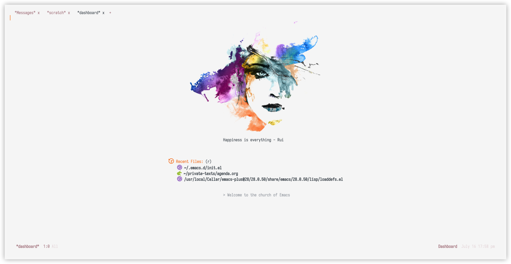
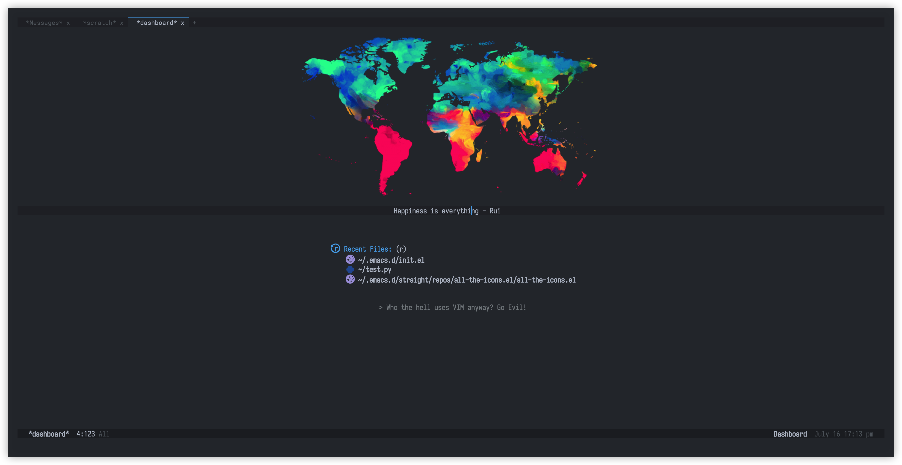

[](https://opensource.org/licenses/MIT)

# About
 This is my Emacs configuration file(s) to implement a *self-use* cross-platform editor/IDE. It has been tested for Emacs 27.2/28.0.05 (with native-compilation feature) on MacOS (Big Sur), Linux (Ubuntu 20). Windows may not be well supported because of possible limitations from cygwin/MSYS2. WSL2 is recommended instead.

# Screenshot


The splash is downloaded from [the free png image website](https://www.freepngimg.com)

# Quick-start

Install Emacs and download the init files in your `$HOME` directory:
```bash
cd ~
git clone https://github.com/Leslieying/.emacs.d.git
```
Then have some beverage and wait for downloading :smile:

# Features

> *All features come from community's efforts*, not mine.

- Fast start-up (load more than 100 packages in <1s)
- Modern UI (directory explorer, theme, color-scheme, minimap, file icons, etc)
- Multiple programming languages support and syntax highlighting (R, Python, TeX, Fortran, etc)
- IntelliSense
- Go-to definition
- Snippets
- Quick documentation
- Spell and lint checker
- Project management
- Git integration as version control
- Easy remote file operation as local
- Perfect org-mode as lightweight markup language and todo manager
- PDF support
- Email client

# License
The project uses [MIT license](LICENSE).
