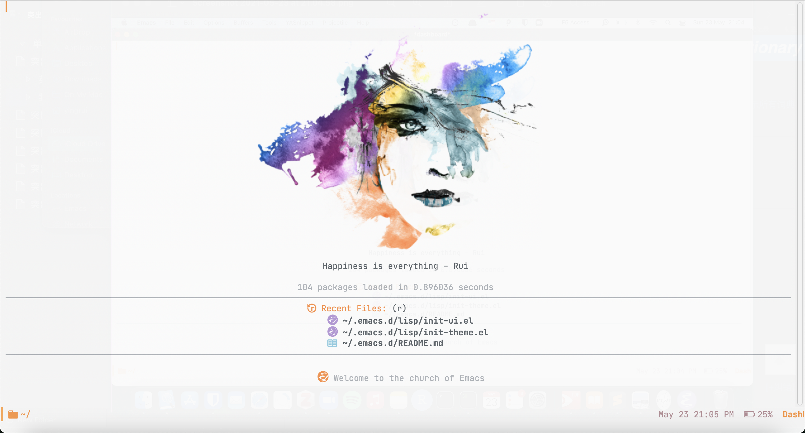

# About
 This is my Emacs init file(s) to implement a *self-use* cross-platform editor/IDE. It has been tested for Emacs >27 version on OSX (Big Sur), Linux(Ubuntu). Windows_NT may not be well supported because I use WSL2.

# Screenshot


The splash is downloaded from [the free png image website](https://www.freepngimg.com)

# How to install

Install Emacs and download the init files in your `$HOME` directory:
```bash
cd ~
git clone https://github.com/Leslieying/.emacs.d.git
```
Then have some beverage and wait for downloading :smile:

# Structure

I divide my init files into several different elisp files and use init.el to call them.
The structure is like:
```text
  +-- ~/.emacs.d
     +-- init.el
     +-- lisp folder
         +-- init-*.el
```

# Features

I have to say *all features come from community's efforts*, not mine.

- Fast start-up
- Modern UI (directory explorer, theme, color-scheme, minimap, file icons, etc)
- Multiple programming languages support and syntax highlighting (R, Python, TeX, Fortran, etc)
- IntelliSense
- Go-to definition
- Snippets
- Quick documentation
- Spell and lint checker
- Project management
- Git integration as version control
- Easy remote file operation as local
- Perfect org-mode as lightweight markup language and todo management
- PDF support
- Email client

# License
The project uses [MIT license](LICENSE).
